# djobs

<!-- mcp-name: io.github.jhuang-tw/djobs -->

**Crash-proof checkpoints and resumable task memory for AI coding agents.**

djobs keeps long coding work recoverable when a terminal command fails, an IDE
closes, or a chat loses context. Deterministic hooks cover the common command
path; compact MCP tools track structured multi-file work; `djobs gain` makes the
estimated context savings visible.

[](https://github.com/jhuang-tw/djobs/actions/workflows/ci.yml)
[](https://pypi.org/project/djobs/)
[](https://jhuang-tw.github.io/djobs/)
[](LICENSE)
[](https://www.python.org/downloads/)

<p align="center">
  
</p>

## Why djobs

A coding agent can finish twelve files, lose its chat, then spend the next
session re-reading the repository and guessing what remains. djobs stores exact
work state in SQLite so completed work stays completed and failed or interrupted
work can be resumed without replaying the whole conversation.

| Layer | What it does |
|---|---|
| `preToolUse` hook | Rewrites meaningful Bash or PowerShell commands through a durable wrapper before execution. |
| `sessionStart` hook | Injects unfinished and failed checkpoints into the next compatible session. |
| MCP tools | Track semantic tasks, evidence, batches, dependencies, revisions, and multi-agent claims. |
| `djobs gain` | Reports estimated savings for 24 hours, 30 days, and all time. |

Everything is local by default: one SQLite file, no Redis, no broker, and no
cloud service.

## Quick start

### VS Code and GitHub Copilot

Install the **djobs — Coding Checkpoints** extension from the Marketplace, then
run **djobs: Set up / Repair djobs** from the Command Palette.

The extension installs or repairs the Python runtime, registers the MCP server,
and installs deterministic lifecycle hooks without adding a persistent sidebar or poller.

### CLI and MCP-compatible hosts

Install the runtime once, then initialize each repository:

```bash
pipx install djobs
cd your-repository
djobs init
```

`djobs init` writes the MCP configuration, installs the hook configuration,
adds optional agent guidance, runs `djobs doctor`, and prints the resolved queue
location.

Useful commands:

```bash
djobs doctor                 # verify runtime, MCP, database, and hooks
djobs hook install           # install or repair hooks only
djobs pause                  # temporarily disable hooks and recovery
djobs unpause                # re-enable them
djobs receipt                # evidence-backed work summary
djobs gain                   # estimated token/context savings
```

## Automatic command checkpoints

Smart mode checkpoints tests, builds, linters, type checks, and substantial
compound commands. It skips shell-state commands such as `cd` and read-only
commands such as `git status`.

```bash
djobs hook install --mode smart   # recommended
djobs hook install --mode all     # checkpoint almost every terminal command
djobs hook install --mode off     # keep config installed but disable rewriting
djobs hook install --global       # share ~/.djobs/global.db with MCP
djobs hook doctor                 # validate the installed hook file
```

The wrapper preserves the original command output and exit code. Successful
automatic checkpoints are archived after audit evidence is recorded; failed or
interrupted checkpoints remain recoverable. Hook handling is fail-open: a djobs
problem does not block the original coding task.

## Savings analytics

```bash
djobs gain                         # current workspace
djobs gain --graph                 # 30-day ASCII graph
djobs gain --history               # recent checkpoint estimates
djobs gain --daily                 # daily non-empty totals
djobs gain --all --format json     # all workspaces, machine-readable
djobs stats                        # alias
djobs state                        # alias
```

The report separates automatic-hook savings from durable-workflow savings. Its
numbers estimate avoided replay, re-reading, and re-planning using published
assumptions; they are not provider billing data.

## Structured workflows

For semantic multi-step work, the default MCP server exposes compact batch and
revision-aware tools such as:

- `enqueue_batch` and `complete_batch` for many tasks in one tool round trip.
- `resume_capsule` for a bounded recovery view.
- `resume_delta` for changes since a saved revision.
- `work_receipt` for evidence plus Git working-tree checks.
- `claim_task`, dependencies, resource locks, and agent heartbeats for shared queues.

Advanced queue features also include retries, dead-letter preservation, SQLite
and PostgreSQL backends, a local read-only web dashboard, and a full audit log.

## Compatibility

| Host | Current status |
|---|---|
| GitHub Copilot in VS Code | Automatic hooks, native MCP registration, setup, pause/resume, and diagnostics are implemented and tested. |
| GitHub Copilot CLI/cloud hook format | Supported by the hook adapter and unit tests. |
| Claude Code, Codex, Cursor, Cline, Gemini, other MCP hosts | MCP workflows are available when the host supports MCP. Automatic hook behavior depends on that host's hook protocol and still needs broader real-world validation. |
| Plain browser chat without tools | Not automatic; djobs needs MCP or a compatible installed hook host. |

The compatibility table is intentionally conservative: shared protocol support
is not presented as proof of full end-to-end validation on every agent.

## Safety and privacy

- Queue data stays local unless you intentionally point clients at a shared database.
- Default MCP auto-approval is read-only; write tools remain explicit unless enabled.
- Coding MCP entry points do not start background workers or schedulers; run `djobs serve` explicitly when general-purpose job execution is wanted.
- `djobs pause` disables rewriting and recovery without deleting state.
- The local dashboard binds to `127.0.0.1` by default and has no public-auth layer.
- Tool output is treated as data, not as instructions that override the user.

## Maintained documentation

To prevent documentation drift, this repository keeps a small set of canonical
sources:

- `README.md` — product behavior, setup, compatibility, and user commands.
- `CONTRIBUTING.md` — development workflow and architecture map.
- `AGENTS.md` — short rules for AI contributors working on this repository.
- `CHANGELOG.md` — release history and release notes.
- `docs/RELEASE.md` — the release runbook.

The live landing page is generated from the same product claims in
`docs/index.html`; implementation truth remains in code and tests.

## Development

```bash
git clone https://github.com/jhuang-tw/djobs.git
cd djobs
python -m venv .venv
pip install -e ".[dev,pg]"
pre-commit install
pre-commit run --all-files
pytest -q
```

See [CONTRIBUTING.md](CONTRIBUTING.md) before changing code and
[docs/RELEASE.md](docs/RELEASE.md) before publishing.

## License

[MIT](LICENSE)
