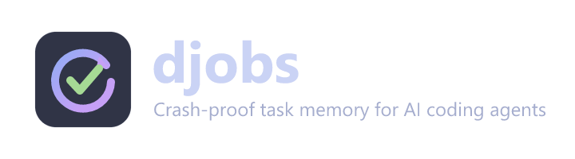

# djobs



A thin VS Code sidebar for djobs crash-proof task memory.

## Features

- Shows djobs tasks grouped by status.
- Refreshes from the local djobs SQLite database through the `djobs status` CLI.
- Copies task IDs and opens task JSON for inspection.
- Provides a Resume command that copies a ready-to-use Copilot Chat prompt.

## Requirements

Install djobs in your workspace Python environment:

```bash
pip install djobs
djobs install-mcp
```

If djobs is installed somewhere other than `.venv`, set `djobs.pythonPath` in VS Code settings.
